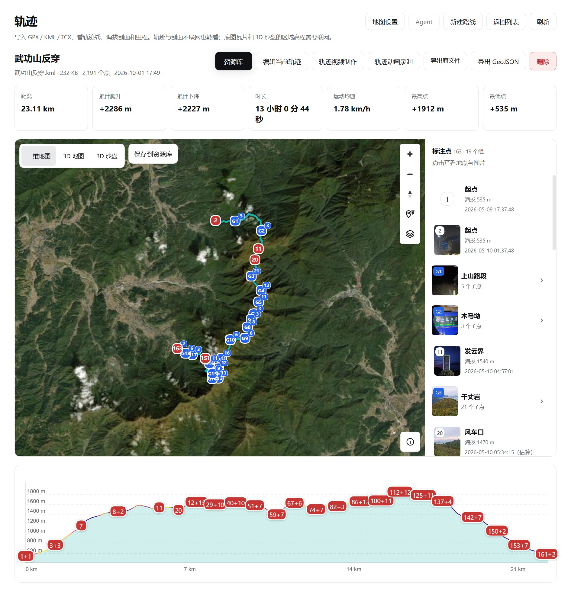
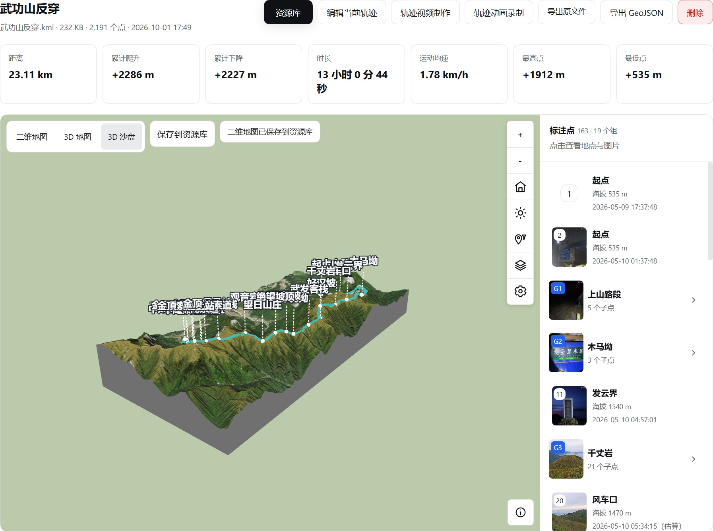
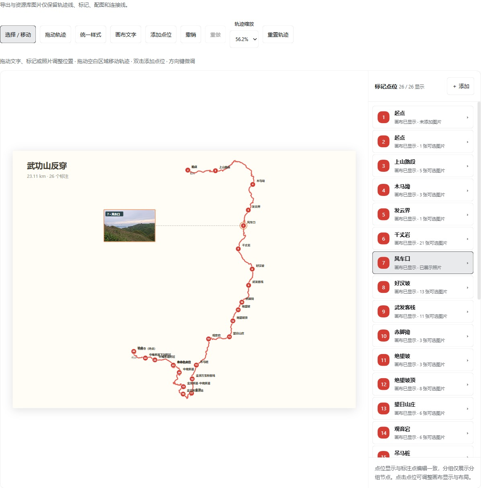
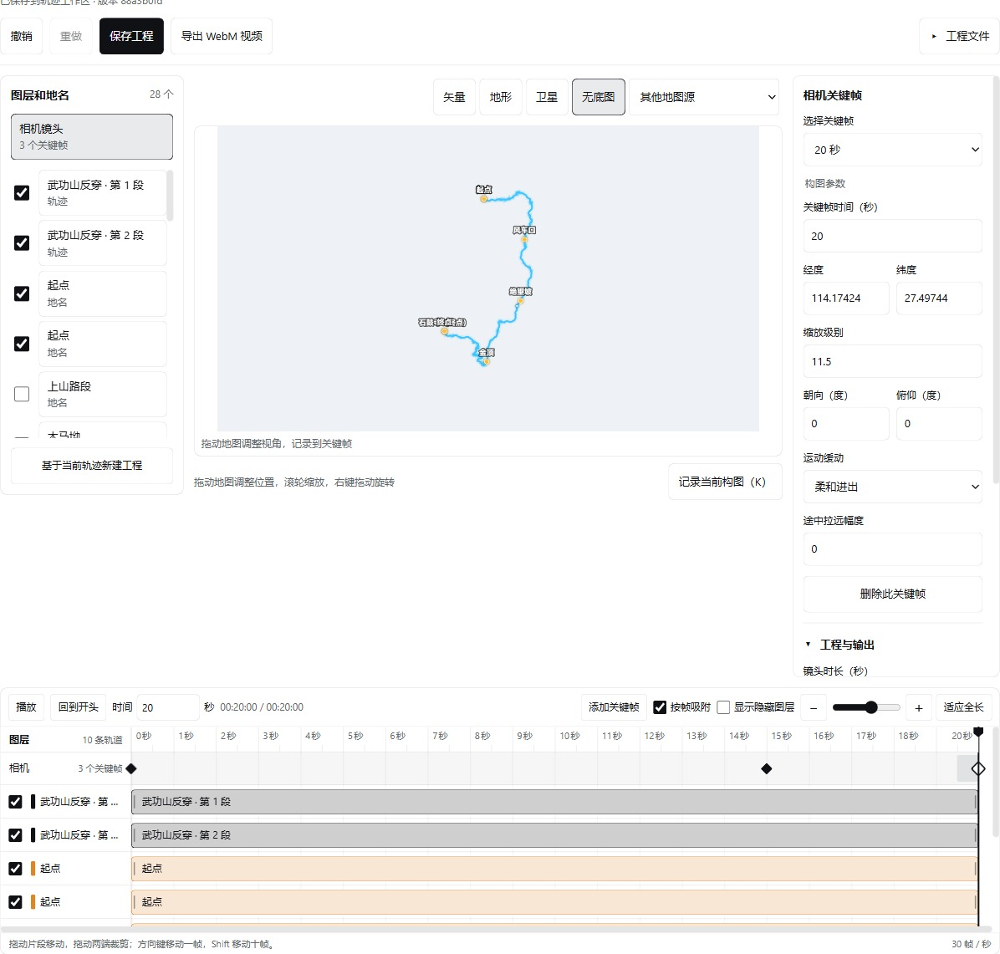
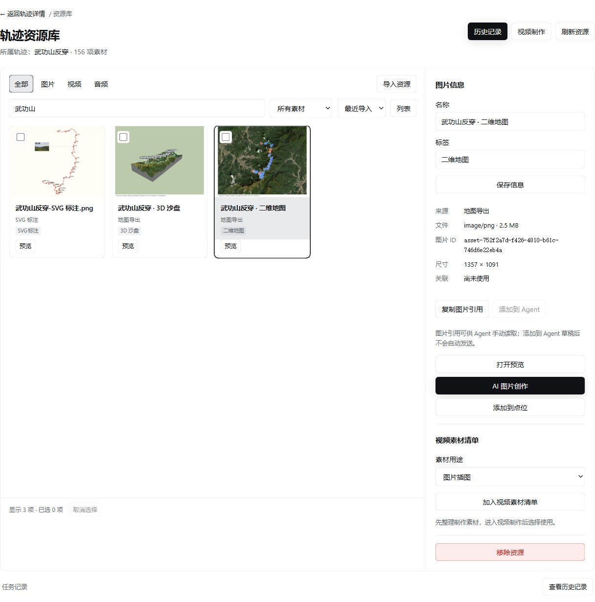

# Track · 轨迹

**e宝工坊中的轨迹与旅程素材工作台。** 导入路线，查看地图和山体，整理沿途照片，再制作可编辑的路线图与地图镜头。

[](https://www.npmjs.com/package/cqai-dsh-plugin-track)
[](package.json)
[](LICENSE)

[安装](#安装) · [快速开始](#快速开始) · [用户指南](docs/track-user-guide.md) · [开发](#开发) · [发行记录](https://github.com/g-dxw/dsh-plugin-track/releases) · [反馈问题](https://github.com/g-dxw/dsh-plugin-track/issues)



界面预览使用武功山示例线路，见[截图与环境说明](docs/assets/readme/README.md)。

从一条真实路线出发，把地图、地点、照片和制作工程留在同一个工作区。界面跟随 e宝工坊的浅色、深色与主题设置，轨迹和素材按线路在本机保存。

## 能做什么

| 功能 | 用途 |
| --- | --- |
| **轨迹与地图** | 导入 GPX / KML / TCX，查看二维地图、卫星影像、3D 地图和山体沙盘，以及距离、爬升、时长与海拔剖面。 |
| **编辑与标注** | 新建、补线、拆分、合并或反向线路；整理地点、分组、照片与显隐，线路编辑保存为新 GPX 副本。 |
| **SVG 路线图** | 调整路线、标记、照片和连接线的位置、尺寸与样式；保存可编辑布局，导出 SVG 或保存 PNG 到资源库。 |
| **旅程资源库** | 集中管理图片、视频和音频，搜索、预览、加标签，复用点位照片、地图截图与视频素材。 |
| **AI 图片与 Agent** | 使用主体/效果参考、提示词模板与生成历史创作图片；把选中的图片加入当前线路的 Agent 草稿。 |
| **镜头与视频策划** | 在共用工作台编辑地图和沙盘镜头，保存关键帧与多轨时间轴，输出 WebM；连接 OpenMontage 逐阶段确认策划并回填分镜素材。 |

<details>
<summary>查看沙盘、路线图、镜头工作台与资源库</summary>

| 3D 沙盘 | SVG 标注 |
| --- | --- |
|  |  |
| 镜头工作台 | 旅程资源库 |
|  |  |

</details>

## 安装

先安装支持插件的 **e宝工坊 Desktop**。本版依赖的 **DSH 接口包范围为 `^0.1.5-rc.1`**；采用 0.2.x 接口包的 Desktop 需要相应的兼容版本。Track 以独立插件提供，在插件管理中添加：

```text
cqai-dsh-plugin-track@0.1.3
```

也可以使用 DSH 命令行：

```sh
dsh plugin --profile desktop add cqai-dsh-plugin-track@0.1.3
```

安装后重启应用，从侧栏 **轨迹** 进入。本版说明见 [0.1.3 发行记录](docs/releases/track-0.1.3.md)，后续版本见 [GitHub Releases](https://github.com/g-dxw/dsh-plugin-track/releases)。

基础轨迹、地图与素材管理可以独立使用。AI 图片需宿主提供可用的生图服务；左侧 Agent 需支持项目会话的 Desktop。OpenMontage 策划另外需要本机源码、Python 环境及用于视频回填的 FFprobe，配置方法见 [接入说明](docs/track-openmontage.md)。

## 快速开始

1. **导入路线**：拖入 `.gpx`、`.kml` 或 `.tcx`，也可点击「选择文件」批量导入。打开路线后先查看二维地图、地点与海拔。
2. **整理地点**：进入「编辑当前轨迹」，调整标注、分组和照片；需要修改路线时切到「线路编辑」，保存新副本。
3. **制作路线图**：在「SVG 标注」排版路线和照片，保存画布，导出 SVG；地图和画布也可「保存到资源库」。
4. **整理旅程素材**：打开「资源库」，导入图片、视频与音频，登记用途。选择图片进入「AI 图片创作」，生成结果经确认保存后再使用。
5. **制作地图镜头**：进入「轨迹视频制作 → 镜头编辑」，选择地图或 3D 沙盘，调整构图和关键帧，先保存工程，再输出视频。需要完整策划时切到「脚本策划」连接 OpenMontage。

详细操作、地图配置与恢复方法见 [用户指南](docs/track-user-guide.md)。

## 可以输出什么

| 输出 | 内容 |
| --- | --- |
| 原始 GPX / KML / TCX | 当初导入的原文件，逐字节保留。 |
| GPX 副本 / GeoJSON | 编辑后的新线路，或便于其他地图工具读取的路线与起终点。 |
| SVG / PNG | 路线、标记、照片、连接线和端点符号；SVG 可继续编辑，PNG 可进入资源库。 |
| WebM | 地图逐帧编码，或 3D 沙盘实时无声录制；保留实际地图来源署名。 |
| 工程 JSON | 地图/沙盘镜头的可编辑备份；下载视频不能替代保存工程。 |

当前边界：

- 支持 GPX、KML、TCX；单个轨迹文件最多 **8 MiB / 50 万点**，暂不支持 FIT 或实时 GPS。
- 缺失的文件海拔不会被补造。3D 山体来自在线高程数据，与原始海拔统计分别处理。
- 资源库可管理、预览视频与音频；当前镜头工作台输出 WebM，尚未接入整片混剪、旁白/音乐混音和原生 MP4 导出。
- 沙盘录制目前为 **1280 × 720、目标 30 fps**，实际帧率取决于设备负载。
- AI 多图、画幅、质量与出图数量取决于宿主及模型能力。提交由用户主动触发，结果先作为候选；本文截图不代表真实模型生成效果。
- OpenMontage 不随插件内置。地图/沙盘分镜回填会保留历史版本，完整影片合成仍由外部制作流程负责。

## 本地数据与联网

轨迹原文件、点位、照片、资源索引与已保存工程写入当前 DSH 数据目录。默认地图服务可直接使用；MapTiler 可选，需自有 Key。

| 操作 | 联网需求 |
| --- | --- |
| 查看本地轨迹、统计与海拔；编辑线路、点位和 SVG | 可离线使用。 |
| 查看已缓存照片、整理本地媒体和已保存工程 | 可离线使用；远程图片首次加载需联网。 |
| 地图底图、卫星影像、3D 区域高程 | 需要联网；二维可切换「无底图」。 |
| 新的 AI 图片、提示词优化或 Agent 模型请求 | 需要宿主服务与网络。 |
| OpenMontage 本地项目 | 依赖已配置的本机环境；策划 Agent 使用宿主模型服务。 |

主要保存位置：

```text
<DSH home>/
├── track/<trackId>/              轨迹、照片、素材与单线路镜头工程
├── track-agent/tracks/<trackId>/  线路 Agent 会话、上下文及图片引用
├── track-agent/openmontage/      OpenMontage 项目、分镜与历史视频
└── track-resource-templates/     个人提示词模板
```

地图设置和 AI 创作草稿另存于当前浏览器的本地存储。备份或迁移时，除了 DSH 数据目录，也要保留对应应用 Profile；完整目录与保存说明见 [用户指南](docs/track-user-guide.md#数据保存与备份)。

## 开发

使用 **Node.js `^22.19.0` 或 `>=24.0.0`**、**Yarn `4.18.0`**：

```sh
git clone https://github.com/g-dxw/dsh-plugin-track.git
cd dsh-plugin-track
corepack yarn install --immutable
corepack yarn typecheck
corepack yarn build
corepack yarn test --maxWorkers=2
```

构建后，在项目根目录安装本地插件，并重启 e宝工坊：

```sh
dsh plugin --profile desktop add .
```

发行包包含编译入口、对应源码、构建输入、测试与第三方声明。发行包的源码复现步骤见 [BUILDING.md](BUILDING.md)。

测试覆盖解析与原文件导出、真实 HTTP/本地存储、地图与沙盘、线路/点位/SVG 编辑、素材和 AI 任务协议、镜头工程及录像资源清理。AI 协议测试使用受控响应，真实账户和模型效果需单独验证。

## 文档

| 文档 | 内容 |
| --- | --- |
| [用户指南](docs/track-user-guide.md) | 导入、编辑、地图、素材、输出与数据备份。 |
| [镜头工作台](docs/track-shot-editor.md) | 地图与沙盘工程、时间轴、输出和恢复。 |
| [视频策划](docs/track-video-script.md) | 从目标与素材到脚本、分镜及片段制作。 |
| [OpenMontage 接入](docs/track-openmontage.md) | 本机环境、原生项目、Agent 与素材回填。 |
| [Agent 图片引用](docs/track-image-agent-references.md) | 图片副本、引用与添加到对话草稿。 |
| [AI 图片创作验收](docs/track-ai-image-workspace-validation-v2.md) | 多图输入、历史恢复及验证范围。 |
| [武功山位置镜头示例](examples/wugongshan-location-preview/README.md) | 可复用、可编辑的真实路线与山体镜头。 |
| [0.1.3 发行说明](docs/releases/track-0.1.3.md) | 本版发行调整与验证记录。 |

## 贡献

欢迎通过 [Issues](https://github.com/g-dxw/dsh-plugin-track/issues) 提交问题或功能建议。报告问题时请附插件/宿主版本、复现步骤和必要截图；能提供可公开的最小轨迹样例会更便于排查。

提交改动前运行类型检查、构建及与改动相关的测试。使用真实样例核对线路、坐标与媒体结果，并遵循 [仓库约定](AGENTS.md)。

## 许可证与来源

Track 按 **AGPL-3.0-only** 分发，见 [LICENSE](LICENSE)。上游移植与修改记录见 [PROVENANCE.md](PROVENANCE.md)；第三方组件保留各自版权与许可证，见 [THIRD_PARTY_NOTICES.md](THIRD_PARTY_NOTICES.md)。
