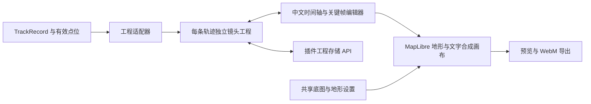

# GeoMotion 集成方案

审查日期：2026-10-04。本文是新分支的接入设计，尚未实现编辑器集成。

## 已保存的基线

- Track 插件：`main` 的 `0276a0d40473d29f8cedca422b3c718ef3661626`。
- 集成分支：`codex/geomotion-integration`，从上述基线创建。
- 基线提交包含现有源码、配置、测试、文档；`outputs/` 的样片与验收输出保留在本地。
- 本轮重新执行 `corepack.cmd yarn typecheck` 和 `corepack.cmd yarn build`，均通过；未重新执行完整测试集。
- GeoMotion 参考仓库：[databandar/geomotion](https://github.com/databandar/geomotion)，本地位于 `E:/workspace/project/geomotion`，上游基准提交为 `a911219b1f0d704aa10f1fc915df65c21f612ec1`。现有中文修改仍在该独立目录，尚未复制到插件。

## 推荐接入方式

在现有“轨迹视频制作”工作区增加原生中文 GeoMotion 编辑模式。Track 管理轨迹、点位与地图设置；新编辑器管理相机关键帧、图层时间、字幕和录制。

| 方案 | 结果 | 取舍 |
| --- | --- | --- |
| 中文 Studio 作为原生 React 视图，抽取必要核心模块 | 最接近目前体验的时间轴与镜头操作；推荐 | 需适配宿主 React、样式、状态、持久化和地图设置 |
| 复用动画求值模块，继续扩展现有 Three 沙盘编辑器 | 可延续现有米制沙盘相机 | 两种相机协议不同，界面和相机转换工作量更大 |
| Track 导出兼容工程 JSON，由独立 GeoMotion 打开 | 可先验证实际路线与地名的转换 | 适合早期数据验收，尚不能在插件内编排 |

入口使用 `src/client/TrackPanel.tsx` 的“轨迹视频制作”和 `src/client/TrackVideoScript.tsx` 的模式切换。新视图不调用独立应用 `main.tsx` 的 `createRoot`，由现有 DSH 插件组件树挂载。当前二维地图默认值与现有沙盘草稿继续沿用。

## 数据适配

正式输入类型为 `src/protocol.ts` 的 `TrackRecord`。路线坐标是 `[lon, lat, ele, time]`，分段字段 `segmentStarts` 为可选。使用现有解析逻辑得到的有效路线上下文；旧记录省略该字段时按插件规范恢复分段。

| Track 输入 | GeoMotion 工程 | 规则 |
| --- | --- | --- |
| 一条轨迹的有效分段 | 每段独立 RouteLayer | 保留点序；使用 `curve: 'straight'`；不画断点之间的连接线 |
| 有效地图点位 | MarkerLayer 与文字 | 取 `useTrackPlacemarks` 的编辑、增加、删除、排序、分组和隐藏状态；保留来源 ID、名称与坐标 |
| 高程、点时间、来源轨迹 ID | 桥接元信息与 Track 原始数据 | GeoMotion RouteLayer 只接收经纬度；高程和时间不能在转换中丢失 |
| 画布标注 | 可选择转为地名或字幕 | 地理坐标使用 `sourceCoordinates` 或有效 `pointIndex`；`position.x/y` 是画布坐标 |
| 现有沙盘镜头草稿 | 继续使用原编辑器 | `position/target/fov` 与地理相机 `center/zoom/bearing/pitch` 不进行静默转换 |

具体约束：

- 路线播放进度按各段真实累计距离分配；首版采用连续时间切换分段，断点处不插入飞行路线。零长度段与只有一个点的段显式处理。
- 分组按当前可见组的展示方式导入；首版保留成员 ID 与坐标元信息，组成员展开列入后续能力，需要生成子 MarkerLayer 并提供显式展开操作。隐藏点位和隐藏组不自动进入画面。
- 使用当前已保存的点位状态，等待点位加载完成；有未保存编辑时需明确导入的是哪个快照。
- 工程记录 `sourceFingerprint`。来源变化后提示刷新路线/地名，由用户选择，不自动覆盖已编排镜头。
- 不直接使用 `createPlaybackPath(points)` 生成多段路线，该函数没有分段参数；参考 `trail-layer.ts` 的 MultiLineString 和 `shot-cases.ts` 的分段距离计算。
- GeoMotion 默认 geodesic 曲线会对相邻点密集插值；徒步路线固定 straight，避免膨胀点数和改变实际线形。

## 编辑器与宿主边界

1. **React 与打包。** Track 使用 React 18.3.1，GeoMotion Studio 当前依赖 React 19.1。只读检索未发现必须使用 React 19 的 API，兼容性仍需实际构建和挂载确认。React 与 JSX runtime 继续由宿主提供；所需 `@geomotion/*`、Zustand/Immer 等依赖内联到插件，执行现有 `verify-client-bundle.mjs`，避免出现宿主无法 require 的模块。
2. **状态实例。** 原 GeoMotion store/history 是模块单例，持久化只使用 `geomotion:project`。改为每个编辑器实例独立的 store 与 history，通过 track ID/project ID 选择工程；切换轨迹时释放旧实例，避免草稿与撤销历史串用。
3. **样式和语言。** CSS 限定在 `.trk-geomotion` 容器内，映射现有 `--trk-*` 宿主主题。语言与主题使用实例配置，不修改宿主 `document.title`、`html lang` 或 `html data-theme`。
4. **快捷键。** 仅在编辑器获得焦点时处理 K、播放、删除与撤销；输入框内继续采用文本编辑行为。实例调试接口替代全局 `window.geomotion`。
5. **地图实例。** 复用同一份 MapLibre 依赖和 Track 设置，编辑画布独立拥有 Map 实例。关闭编辑器时释放监听、RAF、录制流与地图，避免与轨迹浏览地图争用相机及 style。
6. **地形与署名。** 接入 Track 的 `styleFor`、`terrainProviderFor` 和 `configureMapTerrain`；免费地形优先，MapTiler 可选。URL、encoding、tileSize、maxzoom、来源署名一起适配，密钥不写入镜头工程或导出 JSON。
7. **低角度标签。** GeoMotion 地名属于 Canvas overlay，没有山体深度遮挡。首版真实地形、低角度镜头需要验收；遮挡或贴地标签能力作为明确的后续能力。

## 独立工程存储

建议新增 `src/geomotion-project-store.ts` 和 `/geomotion-project` 的 GET/POST API，由现有 `api()` 走插件同源请求。

- 文件建议为 `<DSH home>/track/<trackId>/geomotion-project.json`；以后多工程时扩展为项目 ID 子目录。
- 外层保存 `version/trackId/revision/sourceFingerprint/document`；内层 GeoMotion 文档格式当前为 7，插件封装版本独立维护。
- 借鉴 `annotations-store.ts` 的临时文件与原子 rename，以及现有点位状态 API 的 revision 冲突处理。
- 保存失败时保留当前内存工程并提示重试；工程 JSON 可手动导出。浏览器缓存可以用于恢复，不能作为唯一存储。
- 工程写入不修改 `track.json`、原始导入文件、点位状态或画布标注；删除轨迹时同步处理所属工程。
- 旧 `cqai-track.shot-editor.<trackId>` 草稿仍按原协议读取。

## 渲染和导出

GeoMotion 的帧链路可按 `evaluate(project, t)` → 相机 `jumpTo` → `syncScene` → 文字 Canvas overlay 接入。现有 RenderHost 已公开地图、overlayCanvas、`renderFrameAt(t)` 与 `waitForIdle`，不需要探测 React 内部状态。

插件封装提供 `renderAt(t)`、`getCamera()/setCamera()`、`getCaptureCanvas()`、`dispose()`。预览、拖动播放头与导出使用同一套按时间求值逻辑。

- 预览和导出保持相同构图：Canvas 始终按输出宽高渲染，界面仅做 CSS 缩放；保留 `map.setPixelRatio(1)` 与 `canvasContextAttributes.preserveDrawingBuffer=true`。不能先按面板尺寸渲染再放大导出，否则相同 zoom 的地理范围会变化。
- 首版导出 WebM：把地图、地名、字幕与地图来源署名合成到同一个 Canvas 后录制。不能依靠 DOM 标签自动进入视频。
- 实时 MediaRecorder 以墙钟运行，不能保证逐帧采样精确。后续 PNG 序列采用 `i/fps` 时间采样，再接本地 FFmpeg 输出 MP4。
- 瓦片等待超时需要明确提示缺图或重试；原 `waitForIdle` 超时直接结束等待，不代表全部瓦片已经就绪。
- 录制期间冻结分辨率、帧率、工程快照与地图配置；停止或失败时恢复编辑状态并清理流。

## 建议实施顺序与验收

| 阶段 | 具体交付 | 验收 |
| --- | --- | --- |
| 1. 数据与渲染桥接 | 实际轨迹和有效地名生成独立工程；20 秒环境介绍预览；兼容工程 JSON 导出 | 路线分段无额外连接线，坐标/名称对应实际数据，轨迹源文件内容不变 |
| 2. 原生中文编辑器 | 视频工作区内的关键帧时间轴、地图交互、相机记录、图层时间；工程保存恢复 | 拖关键帧与播放头即时预览；两条轨迹草稿和撤销互不影响；暗/亮主题与窄窗口正常 |
| 3. 视频导出 | 带地名、字幕及署名的 WebM 环境介绍镜头 | 输出视频实际可播放，文字进入视频；失败和退出清理通过 |
| 后续 | PNG 帧序列、MP4、音频、更多镜头模板、标签遮挡 | 再按真实素材和导出链路单独验收 |

新增测试聚焦分段适配、有效点位/分组、工程恢复及冲突、帧求值与退出清理。实际 DSH 原生挂载、地图地形、焦点快捷键和视频结果必须由浏览器/宿主运行证据确认，构建通过不能替代这些验收。

## 上游复用条件

截至本次核查，GeoMotion 本地克隆未找到 LICENSE/COPYING，package 也未声明许可证，公共仓库页面未显示许可证声明。Track 自身为 AGPL-3.0-only，不能据此推定 GeoMotion 也采用该许可证。

正式复制和随插件分发上游代码前，需要明确允许的复用方式与许可证。依据：[GitHub 的仓库许可证说明](https://docs.github.com/en/repositories/managing-your-repositorys-settings-and-features/customizing-your-repository/licensing-a-repository)。当前基线保存、分支创建与接入设计已经完成；本分支暂未引入上游源码。

若许可明确后采用模块抽取，应固定上游 commit、记录中文修改与宿主适配、保留来源及许可说明；构建不依赖 `../geomotion` 这个本地相邻目录。
