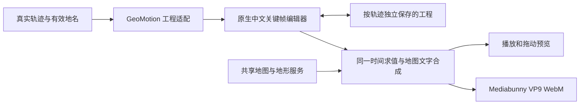

# Track、GeoMotion 与地图视频导出集成

基础集成日期：2026-10-04。2026-10-09 起地图与沙盘镜头使用统一工作台，案例测试台已移除；历史验证材料保留。

## 三个项目各负责什么

| 来源 | 实际用途 |
| --- | --- |
| Track 插件 | 真实轨迹分段、已编辑地名/分组、共享地图服务设置、每条轨迹独立工程存储 |
| GeoMotion | 固定提交的格式 7 文档、相机关键帧、任意时间求值、MapLibre 图层同步及 Canvas 文字渲染 |
| maplibre-gl-video-export | 环境介绍、环绕、拉远、地点巡游的编排参考；采用 Mediabunny 逐帧编码思想 |

GeoMotion 核心快照自包含于 `src/track/vendor/geomotion`，来源、固定提交和文件哈希见该目录的 `SOURCE.md` 与 `source-manifest.json`。运行、构建均不依赖相邻的 GeoMotion 目录。精简中文界面由 Track 原生 React 18 组件挂载，React 与 JSX runtime 继续由宿主提供。

视频导出项目仅作为模板和编码参考。没有复制其完整控制器，没有修改全局 MapLibre 时钟，也没有用路由服务生成或补齐路线。



## 使用入口与操作

进入轨迹详情 →「轨迹视频制作」→「镜头编辑」，场景选择「地图」或「3D 沙盘」。顶部页签可进入素材准备和脚本策划。

- 拖动、缩放、旋转地图后，点击「记录当前构图」或在编辑器内按 K。
- 剪辑式时间轴让相机关键帧、路线、地名和文字共用秒刻度与播放头；支持缩放、适应全长、按帧吸附、方向键移动一帧和 Shift 移动十帧。可调整经纬度、缩放、朝向、俯仰、缓动及途中拉远幅度。
- 环境介绍、环绕航拍、升高拉远、地名巡游四个模板应用后仍是可编辑关键帧。
- 时间轴直接移动片段、拖动两端裁剪；移动路线时其绘制关键帧同步平移，裁剪只改变显示窗口。左侧控制显隐，右侧保留秒数输入和淡入淡出。隐藏轨道可按需显示，锁定图层保持只读；工程修改不改原轨迹或点位名称。
- 支持撤销/重做、播放、逐时间预览、JSON 备份与导入。
- 支持 1280×720、1920×1080、720×1280，以及 24/30/60 fps。导出 WebM 时显示进度，可取消。
- 工程底图随工程保存，地图服务配置仍沿用 Track；地图服务 Key 不写入工程 JSON。

## 数据与工程存储

`createGeoMotionProject()` 等待 Track 的有效点位和路线上下文，逐段创建 straight RouteLayer。路线显示进度按真实分段距离分配，片尾保留完整路线；隐藏点位和隐藏分组不进入工程。名称、坐标和显示分组取当前已保存点位状态，未命名点位保留原值。

来源变化只提示「根据当前轨迹重建」，不会覆盖已编排镜头。撤销/重做原子恢复工程与来源指纹。已有完整工程即使原源文件暂时读取失败也能恢复和备份。

工程通过同源 GET/POST `/api/cqai-track/geomotion-project` 保存到：

```text
<DSH home>/track/<trackId>/geomotion-project.json
```

外层为 `cqai-track-geomotion@1`，含 trackId、sourceFingerprint、document、opaque string revision、updatedAt；内层为格式 7。首次写入 expectedRevision=null，后续使用当前 revision，冲突返回 409；临时文件及原子替换避免部分写入。原始文件、track.json、placemark-state.json、标注和旧沙盘草稿保持独立。

## 渲染和导出

预览与导出共用 GeoMotion `evaluate(project, t)`，以输出宽高创建地图，只通过 CSS 缩放预览。逐帧导出使用 `i/fps` 时间戳，每次等待 style、GeoJSON worker 与地图/DEM 瓦片就绪，再将地图、地名、文字与署名合成到一个 Canvas。

导出冻结工程、地图配置、输出尺寸和地图交互；图片及 MapTiler 标志等待有超时并可取消。地图资源失败会显示重试，不把超时当成完整加载。编码、取消和卸载都会释放资源并恢复编辑状态。

首版为 VP9 WebM，无音乐/旁白混音与 MP4 输出；采用内存 BufferTarget，长片会增加浏览器内存占用。地名为二维 Canvas overlay，没有山体遮挡，也未实现自动避让。精简界面可渲染兼容 JSON 中的更多图层，但暂不提供完整 GeoMotion 素材和高级属性编辑器。

## 本地验证与来源记录

整体验收、隔离预览和样片见 `docs/geomotion-integration-validation.md`，剪辑式时间轴更新见 `docs/geomotion-timeline-validation.md`。预览使用武功山真实轨迹快照、既有真实 Esri 影像及真实 Mapterhorn DEM；工程写入独立的测试目录，不改原轨迹。

Track 的已保存基线为 `0276a0d40473d29f8cedca422b3c718ef3661626`。GeoMotion 固定来源为 `a911219b1f0d704aa10f1fc915df65c21f612ec1`；发布者已于 2026-10-08 确认取得分发权限，日常发行沿用该确认，详见 [分发确认记录](releases/geomotion-distribution-record.md)。

视频导出参考仓库 `bjperson/maplibre-gl-video-export` 固定提交 `cc358e34221ce95c6f7381d8d2a5c9fd0ac0a9ad`，上游为 BSD-3-Clause。实际新增依赖 Immer 10.1.1（MIT）和 Mediabunny 1.24.2（MPL-2.0），详见 `PROVENANCE.md`。原型验证阶段没有发布、推送或修改两个相邻参考仓库。
## 二维素材准备（2026-10-04）

进入视频制作后，可先在二维 SVG 画布确认地点、路线分段、图片和介绍，再进入相机与多轨时间轴。已保存 SVG 的名称、说明、显隐、嵌入图片与来源坐标作为候选；未覆盖的有效点位/分组继续带入。画布文字偏移仅影响二维排版，地点保持真实坐标。新标记只能吸附到实际轨迹点。

路线素材保存轨迹点范围，不复制或重写原几何。原始断点保持分开，拆分点两边共享边界点；合并只允许同一原始连接段内的相邻素材。统计按原始连接段计算，不跨断点计距离。

`video-materials.json` 是独立的 `cqai-track-video-materials-envelope@1` sidecar，含修订号和 `cqai-track-video-materials@1` document。GET/POST `video-materials` 使用版本比较与原子写入；上限 100 个标记、200 段路线、30 条信息、8 MiB 嵌入照片和 16 MiB 文档。

只有主动选择照片才加载其像素，使用现有单图压缩及缓存接口。带入镜头会先保存素材，在内存中替换旧素材图层，保留相机关键帧、底图、地形和输出配置；原镜头保存文件要等明确点击「保存工程」才更新。撤销恢复整个原工程。生成图片在合成时根据实际长宽比限制高度，并在底部署名上方保留照片说明空间；普通导入图片不自动调整。路线统计、分段说明与地点介绍根据所选信息行数安排初始位置，之后由时间轴调整显示时段。

详见 `video-materials-validation.md` 的实际轨迹、浏览器、选图与视频证据。
